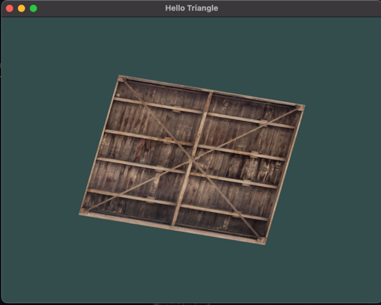

# learn opengl

This repo documents my journey through [learnopengl.com](https://learnopengl.com/)'s excellent OpenGL tutorials. I'm mostly coming from a place of curiosity as to how lower-level graphics APIs work, but I am interested in making some simple 2d and 3d games as well. We'll see how it goes.

## getting started

First up, I couldn't get anything to work well in the getting started section of learnopengl.com. I ended up getting glfw and glew working on macos via the following blog, which was exactly what I needed: http://antongerdelan.net/opengl/hellotriangle.html. I had to install the following to make it work:

```
brew install glfw glew glm
```

I set up the build with CMake:

```bash
$ cmake .
-- Configuring done
-- Generating done
-- Build files have been written to: /Users/michaelhenry/dev/funtastic/branches/learningopengl
$ make
[ 16%] Building CXX object CMakeFiles/hello-window.dir/hello-window.cpp.o
[ 33%] Building CXX object CMakeFiles/hello-window.dir/stb_image.cpp.o
[ 50%] Linking CXX executable hello-window
[ 50%] Built target hello-window
[ 66%] Building CXX object CMakeFiles/game2.dir/game-2.cpp.o
[ 83%] Building CXX object CMakeFiles/game2.dir/stb_image.cpp.o
[100%] Linking CXX executable game2
[100%] Built target game2
```

## hello-window

This is just a simple animation of a texture pulled from learnopengl.com.



## game2

This is a simple example of drawing lots of rectangles to simulate a top-down space shooter environment.


